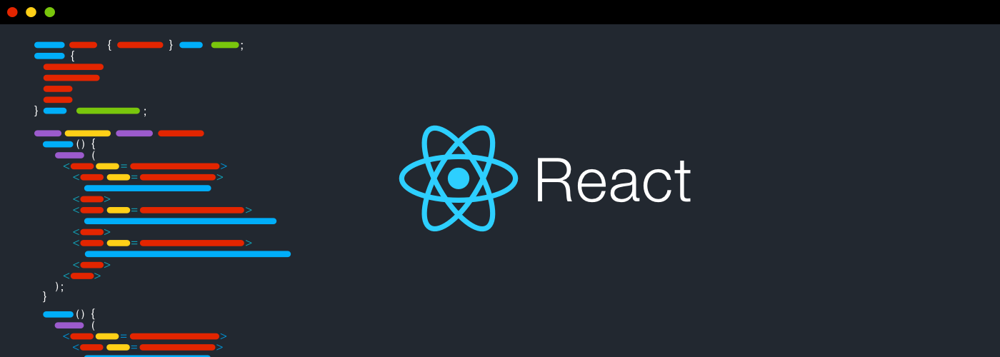

<h1 align="center">React-Redux-TypeScript</h1>
 
<h1 align="center">
  
</h1>

 

<h1>Sobre</h1>

Um projecto basico, relembrando os conceitos do react-redux com a linguagem typescript

<h2>Iniciando o projeto</h2>

:left_right_arrow: yarn start

:left_right_arrow: npm start

<h2>Acessando</h2>

Acesse http://localhost:300 no seu navegador

<h1>Tecnologias</h1>
:computer:&nbsp<strong>ReactJS</strong>
:computer:&nbsp<strong>TypeScript</strong>
:computer:&nbsp<strong>Redux</strong>

<h1>Algumas Imagens</h1>

Repositorio

 
  
  
  
 
 <h1>Types,Reducers, Actions e Sagas</h1>
  
 <h3>Types(Reducer/Actions/Sagas)</h3>
 
  
  
<h3>Reducers</h3>
 
  
  
 <h3>Actions</h3>
 
  
  
 <h3>Sagas</h3>
 
 

